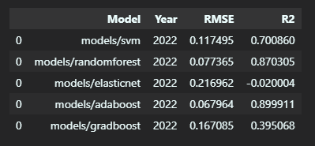

# Predicting the NBA MVP
In this project, we will scrape NBA player data from [Basketball Reference](www.basketball-reference.com) and use it to build a model that will be able to accurately predict the MVP of each season. Basketball Reference has well-structured and formatted historical data on the NBA up to the present.

## Objectives
* How can we use machine learning to estimate what the most important factors are to winning an MVP race for a certain season?
* What other external factors are to be considered when deciding an MVP?

## Requirements
This project is done with Python 3.9+ with the following additionally downloaded packages:
* beautifulsoup4
* selenium
* pandas
* scikit-learn
* matplotlib

These packages can be downloaded in ~/env/requirements.txt for pip or ~/env/nba.yml to create a conda environment.

## Instructions
To download and preprocess the data:
* `python download_data.py`

To train the models:
* `python main.py`

To see the visualizations and rerun saved models:
* See `visualizations.ipynb`

## Scraping Data
We will focus on three specific types of pages when scraping:
* The information on the MVP race of each season
* The statistics of each individual player in the league that season
* The team records of each season

**The crawl delay on Basketball Reference is 3 seconds.**
 

Downloading simple HTML websites were done using the `requests` package. However, we ran into a problem while scraping the player stats webpages using requests, as it did not collect the HTML content for all the players. Thus, we used the `selenium` package to download the content from these pages. After collecting this content, we used `beautifulsoup4` package to scrape the targeted tables and store them into csv files.

## Data Treatment
After obtaining our data for the mvp race, player statistics, and team records, we are ready to clean it in preparation for machine learning.

We start by joining our data all into an overall dataframe. There were a couple caveats when cleaning:
* The team names in team records were full names, such as 'Los Angeles Lakers', while the team names associated with each player in player stats and the mvp race data were abbreviated, such as 'LAL'.
* The Charlotte Hornets had two abbreivations, CHO and CHH, we will default to CHH.
* Add a column that represents if a player made the playoffs or not. Remove players on teams that did not make the playoffs.
* Some players play on multiple teams in a single season. Historically, players who have been traded in the middle of the season have never won an MVP award, so we will remove this from the data.
* We will only take a couple of the data columns from the MVP race data.
    * MVP Share - The amount of votes received / The total amount of votes
    * First Place Votes - The number of first place MVP votes received
    * MVP Rank - The MVP rank of the player
    * Win Share / 48 - How much a player contributed to a win per 48 minutes (one game).

### Establishing Minimum Requirements for an MVP
There is a minimum requirement for each stat that a player has to reach in order to win the MVP race. Of course, players have to go above and beyond to win the MVP, but theses stats represent the lowest averages and statistics by an MVP in the NBA's history. This data was found through StatMuse.
* Games Played: **49 GP** by Karl Malone
* Points Per Game and Field Goals Attempted: **13.8 PPG and 10.9 FGA** by Wes Unseld
* Total Rebounds: **3.3 REB** by Steve Nash
* Assists: **1.3 AST** by Moses Malone
* Field Goal Percentage: **37.8 FG%** by Bob Cousy
* Minutes played: **30.4 MP** by Giannis Antetokounmpo
* Player Efficiency Rating: **18.1** by Bob Cousy
* One one player, Kareem Abdul Jabbar, in NBA history has won the MVP while not making the playoffs

Using these minimums, we cut down the amount of players to 30 players per season.

## Modeling
Now that our data is ready for machine learning, we can try to select various models to find a suitable regression model for our data.

The following models were selected from sklearn:
* Support Vector Regression (SVR)
* Random Forest Regression (RF)
* ElasticNet (EN)
* AdaBoost Regression (ADA)
* GradientBoost Regression (GRAD)

To verify and check the predictive power of our regression models, we will be using the Root Mean Squared Error (RMSE) and R2 metrics.

### Predicting and verifying the 2022 MVP
After training each model on data where we leave out the 2021-2022 season, we get the following metrics.

We can see that our two best models are AdaBoost and RandomForest with the highest R2 scores and lowest RMSE respectively, with SVM performing decently as well.

We also display the MVP Shares, which is the amount of MVP votes that each player received divided by the total number of votes. The image describes the three players with the highest number of MVP votes, with the actual MVP share and comparing it with the predicted MVP shares of each model.

In almost every model except ElasticNet, we accurately predicted that the NBA MVP is Nikola Jokic. More interestingly, we can also see that our model consistently predicts Giannis Antetokounmpo to be higher in the MVP race than Joel Embiid.

### Predicting and verifying the 2023 MVP
After training each model on data where we leave out the 2022-2023 season, we get the following metrics.

We can see that the best performing model for predicting 2023 is AdaBoost with the highest R2 score and lower RMSE by a large margin.

Similarly to above, we display the MVP shares for the top three performing players.

Just like the 2022 predictions, our models predict that Nikola Jokic wins the MVP race for 2023. However, this is incorrect, as we can see that Joel Embiid wins the MVP race by a landslide. Instead, Joel Embiid is mostly predicted to be at second place in the MVP race while Giannis moves down to third.

## Analysis and External Factors
Consistently through both the years that were predicted, we found that our worst model was ElasticNet. The model was unable to learn the patterns behind the stats and MVP shares, thus resulting in a model that predicts the same MVP share accross all players.

The most impactful statistics of a player are their Player Efficiency Rating (PER) and their WinShare (WS), meaning these stats contribute the most to the predicted MVP share of a player.

For 2022, our best performing models were AdaBoost and RandomForest. Additionally, most of our models in 2022 were able to predict correctly that Nikola Jokic wins the MVP race. However, it mostly incorrectly predicted that Giannis Antetokounmpo comes in second place.

For 2023, all of our models predicted that Jokic wins the MVP race. However, Joel Embiid wins the MVP race by a landslide this year.

### How can this be?
#### Voter Fatigue
Nikola Jokic won the MVP race two years in the row, in the 2021 season and the 2022 season, and lost the MVP race to Joel Embiid in 2023. One reason why this could've happened is voter fatigue. This refers to the idea that awards voters tend to favor newer candidates than ones that have already won and established themselves. This has happened many times throughout the history of the NBA, such as Derrick Rose winning the MVP over Lebron James in 2011, and Karl Malone winning the MVP over Michael Jordan in 1997.

#### Narratives
Although statistics are important in defining the performance of a player, a narrative is just as important. It spews ideas and opinions that aren't necessarily backed up with facts or data. What kind of adversities did a player face and how did he overcome it? How important is a player to his team? Does a player need a superteam to win?

These are some examples of popular narratives that surround the NBA's superstars in the present. However, a new narrative arised in the 2023 season with the rise of Embiid and Kendrick Perkins, a basketball analyst.

During most of the 2023 season, Nikola Jokic was projected to be the favorite for winning his third consecutive MVP trophy. Perkins then accused MVP Voters of racism, for voting for a Caucasian male for MVP instead of someone of colored skin, such as Joel Embiid. The comment seemed to completely sway the MVP race into Embiid's favor, with Joel Embiid winning the race by a landslide.

## Conclusion
The inability to accurately predict some of the outcomes, such as the prediction of Giannis in second place in the 2022 season, and the prediction of the Jokic winning the race in 2023 can be explained by external factors, such as voter fatigue and narratives. As machine learning predictions are entirely dependent on statistics, we are unable to reflect these external factors into our models. Voter fatigue and narratives are factors that cannot be transformed into features that we can predict, so if they are strong factors in the season, we will not be able to accurately predict the MVP of that season, as shown by 2023.
